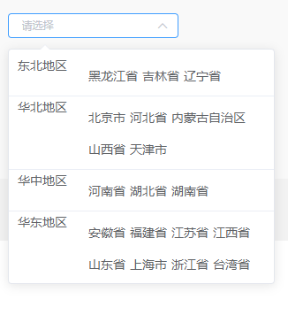
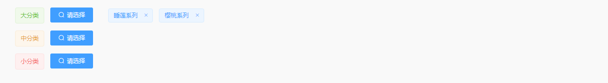

# 常用组件
----

## 1. 上传下载组件

包含模板下载，上传导入，示例如下：

```JavaScript
<uploadAndDowndemo :schema="schema"></uploadAndDowndemo>
```

+ **prop**
  + `schema`: 对象类型，有默认值
    1. `singleFile`: ```true```为横向排版，```false```为竖向排版，
    2. `name`：导入按钮字段
    3. `accept`：接收上传的文件类型
    4. `tips`：上传提示
    5. `uploadUrl`：文件上传的地址
    6. `downUrl`：模板下载的地址
    7. `data`：附带的额外参数
    8. `flowTips`：使用说明的数组

## 2. 省份选择组件

选择省份下拉框，通常搭配选择城市或搭配省市区一起用


```JavaScript
<provinceUI v-model="filters.province" @selectChange="selectChange" />
```
+ **prop**
  + `value`: 对象类型，响应式数据，属性有```label```：省份名、```parentId```：区id、```value```：省份id

+ **event**
  + `selectChange`: 接收选择的省份，并提前调接口渲染城市下拉框列表

## 3. 选择产品弹窗组件

用的比较多的选择产品弹窗，可配置请求路径，勾选产品后会抛出勾选的数组，已勾选的产品也可在组件中回显


+ **prop**
  + `update`: 抛出的已勾选的数组
  + `pitchOn`：用于已有勾选数组时打开选择产品弹窗的回显
  + `requestURL`：请求的接口路径

通常用于点击选择产品按钮出现，使用方法示例如下：

```JavaScript
chooseProduct () {
    let _this = this
    let parameter = {
    pitchOn: _this.totalData.dynamicTags,
    requestURL: URLS.MEMBER.MEMBER_INDUCTION.CONDITION.queryProduct,
    update (data) {
        _this.dynamicTags = JSON.parse(JSON.stringify(data))
    }
    }
    this.$modal.show(chooseProduct, parameter, modelConfig)
},
```
  
## 4. 大、中、小分类组件

通常用于查询条件中，可选择性的显示大、中、小分类



+ **prop**
  + `filtersClass`: 抛出的已勾选的分类
  + `showMiddle`：是否显示中分类
  + `showSmall`：是否显示小分类

```JavaScript
import BigMiddleSmall from '@/components/product/big-middle-small'

<BigMiddleSmall :filtersClass="filters.filtersClass" />

export default {
    data () {
        return {
            filters: {
                filtersClass: {
                    bigClass: [],
                    middleClass: [],
                    smallClass: []
                }
            }
        }
    }
}
```

## 5. 左侧有树状分类的选择产品组件


+ **prop**
  + `update`：抛出的已勾选的数组
  + `selectList`：用于已有勾选数组时打开选择产品弹窗的回显
  + `showStatus`：是否显示有效无效

通常用于点击选择产品按钮出现，使用方法示例如下：

```JavaScript
showProductDialog () {
    let _this = this
    this.$modal.show(SelectProduct, {
        selectList: _this.productList,
        update: (ev) => {
            _this.productList = ev
            _this.productList.forEach(ele => {
            _this.filters.productId += `${ele.uniqueId},`
            })
        }
    }, modelConfig)
},
```