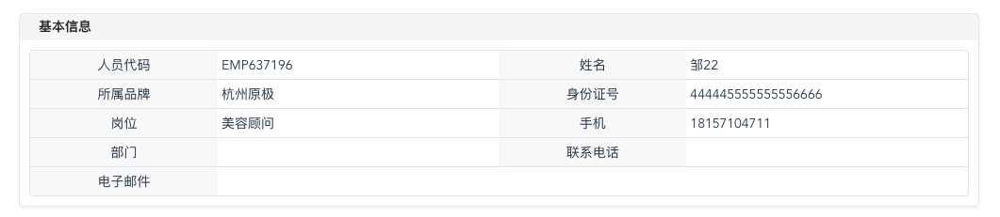

# 内容容器
> 维护者：王浩(gougewh@sina.com)

## 使用场景
内容展示的时候干巴巴的，需要美化一下的时候，可以用这个组件包裹一下。  
说也说不太明白，直接上图。  


## 使用方法
使用 dialog-card 组件，由于使用场景较多，这个组件已经全局注册，直接使用 `<dialog-card></dialog-card>` 即可。
组件默认没有内边距，

```
<dialog-card title="会员资料修改履历">
  <div class="p10"></div>
</dialog-card>
 ```