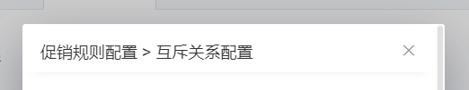
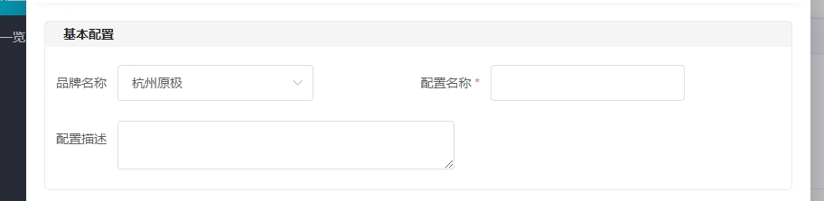
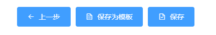
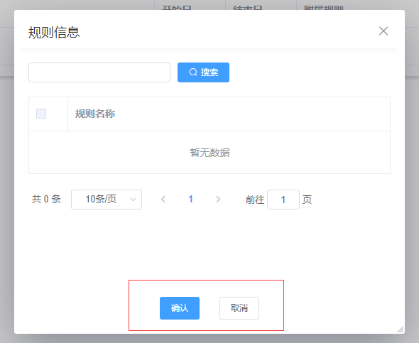
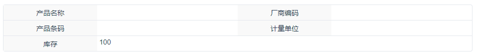
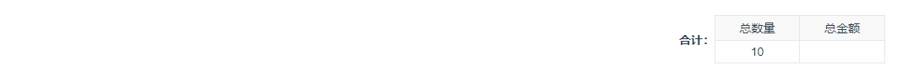

# Dialog对话框
------------------------

>**Dialog是这个项目中使用非常多的模块,添加编辑提示等等,茫茫多的地方都用的到**
## 介绍 Vue-js-modal
虽然项目用的是[element-ui](https://element.eleme.cn/2.0/#/zh-CN/component/installation),但是使用的所有的Dialog都不是element-ui下的Dialog,而是[vue-js-modal](https://www.npmjs.com/package/vue-js-modal).
[vue-js-modal](https://www.npmjs.com/package/vue-js-modal)功能更丰富,调用也比较简单.
## 使用Dialog对话框

一行代码即可调出一个可以自行配置的对话框

```JavaScript
this.$modal.show(component, prop, options)
```

+ `component`: import进来的组件名称

+ `prop`: 类型为object,也可以传null

+ `options`: 负责dialog的大小,是否允许移动,是否允许缩放等等配置.
   + `options`配置灵活,具体参照 [npm上的Vue-js-modal](https://www.npmjs.com/package/vue-js-modal)

   + `options`重复率比较高,可以使用全局的mixin中的一个方法`this.getDialogParameter()`,此方法会返回统一配置的`options`,可以传入2个`number`,第一个为dialog的宽度,第二个为高度,默认为1090*760

## Dialog对话框中使用的组件

### 1. 头部组件
```JavaScript
<dialog-header title="销售规则配置 > 互斥关系配置" @close="$emit('close')" />
```
效果如下:



### 2. 卡片

卡片是布局的作用,块的概念.有自己的头部,稍稍一点hover阴影
```JavaScript
<dialog-card title="基本配置">
  <>...</>
</dialog-card>
```
效果如下:



### 3. 步骤按钮

dialog中的 **下一步 -> 下一步 ->[保存为模板]保存** 的按钮

```html
<dialog-step-btn
  @last="last"
  @next="next"
  @saveTemplate="saveTemplate"
  :template="true"
  :step="operateIndex"
  :min="0"
  :max="4"/>
```
+ **prop**
  + `step`: 步骤的index值
  + `min`: index的最小值
  + `max`: index的最大值
  + `template`: 用来判断是否在最后一步是否有保存为模板(选填)

+ **event**
  + `last`: 上一步
  + `next`: 下一步
  + `saveTemplate`: 保存为模板

+ ***tip*** 没有保存,因为外部的index变量等于了max就执行保存即可.

效果如下:



### 4. 分页

对话框里面经常会有table,也就是经常会有分页.

```JavaScript
import paginationMixin from '@/mixins/pagination'

export default {
  mixins:[paginationMixin],
  mounted () {
    this.getListData()
  },
  methods: {
    getListData () {...}
  }
}

<dialog-pagination 
  :total="total" 
  :pageNumber="pageNumber" 
  :pageSize="pageSize" 
  @changePageSize="changePageSize" 
  @changePageNumber="changePageNumber"/>
```

+ **prop和event**都是element-ui的分页组件需要的,只是隐藏了`page-sizes`和`layout`

+ 此组件需要配合mixin使用,隐藏了`total/pageNumber/pageSize/`三个变量,`changePageSize/changePageNumber`两个函数

***tip*** 需要本地写`getListData()`函数配合

### 5. 包含了确认取消按钮的布局wrap组件

U省了一个foot-button的步骤.此组件在UI上有优化,如果内容填充不满dialog的高度,那么取消确认2个按钮就会在底部,如果超出有了scroll,就会跟随内容到达最底部.

```HTML
<dialog-content @close="close">
  <div>.....</div>
</dialog-content>
```

+ **event**
  + `close(true)` 函数的参数是Boolean,相应的代表用户点击了取消和确认.

***tip*** 还有一个类似的布局组件 (TODO:锚点)

效果如下:



### 6. 用于展示详情信息的UI组件dialog-detail-info

dialog或者页面中经常会有需要展示详情的模块，样式基本统一，因此封装了一个UI组件放在全局，多数时候可配合dialog-card组件调用，样式如下：



+ **prop**
  + `config`: 数组，label为左侧，text为右侧，如果接口返回的值需要前端进行相应处理后才能展示在页面上，此时可自行配置动态具名插槽属性otherType，自定义dom结构，以下为调用示例：

```JavaScript
<dialog-detail-info :config="config">
  <template v-slot:otherType1>
    <div v-if="detailInfo.stockNum < 0" style="color:#f56c6c;">{{detailInfo.stockNum}}</div>
    <div v-else>{{detailInfo.stockNum}}</div>
  </template>
</dialog-detail-info>

export default {
  data () {
    return {
      config: [
        [
          { label: '产品名称', text: this.detailInfo.chName },
          { label: '厂商编码', text: this.detailInfo.manufacturerCode }
        ],
        [
          { label: '产品条码', text: this.detailInfo.barCode },
          { label: '计量单位', text: this.detailInfo.specifications2 }
        ],
        [
          { label: '库存', text: this.detailInfo.stockNum, otherType: 'otherType1' }
        ]
      ]
    }
  },
}
```
### 7. 用于展示合计详情的UI组件dialog-amount

详情dialog中经常用到，合计的字段个数可自行配置，如下：



+ **prop**
  + `dataInfo`: 配置项，数组，调用示例如下：

```JavaScript
<dialog-amount :dataInfo="dataInfo"></dialog-amount>

export default {
  data () {
    return {
      dataInfo: [
        ['总数量', '总金额'],
        [this.detailInfo.totalNum, this.detailInfo.totalAmount]
      ]
    }
  }
}
```


